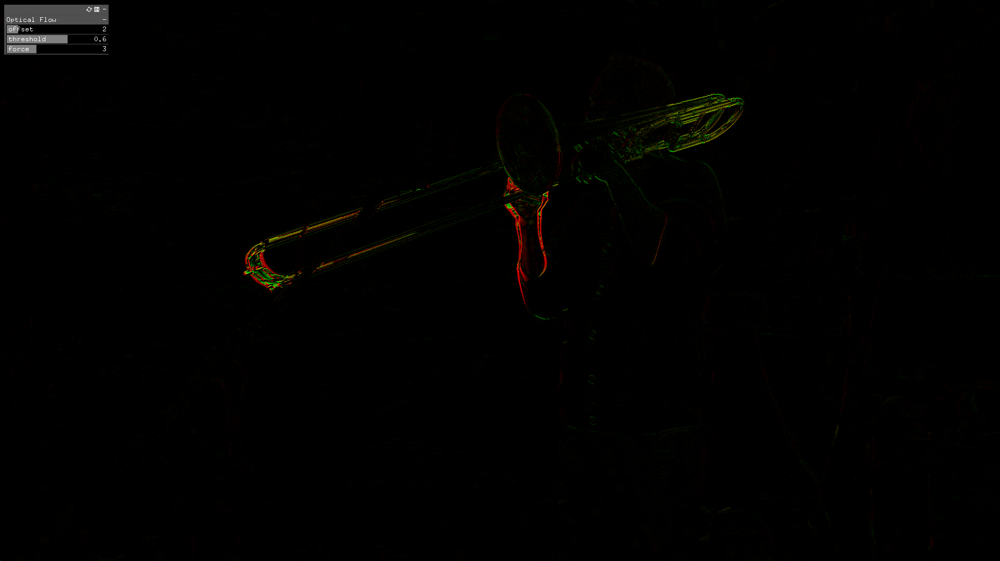

ofxMotionFromVideo
==================

GPU-based optical flow.

Introduction
------------
A simple GLSL-based optical flow implementation to extract movement from a video source.

License
-------
ofxMotionFromVideo is distributed under the [MIT License](https://en.wikipedia.org/wiki/MIT_License). See the [LICENSE](LICENSE.md) file for further details. Just add my name somewhere along your project [Steve Meyfroidt](https://meyfroidt.com) whenever possible.

Dependencies
------------
- [ofxRenderer](https://github.com/smeyfroi/ofxRenderer) contains the GLSL code itself

Compatibility
------------
Developed against OpenFrameworks 0.12+.
