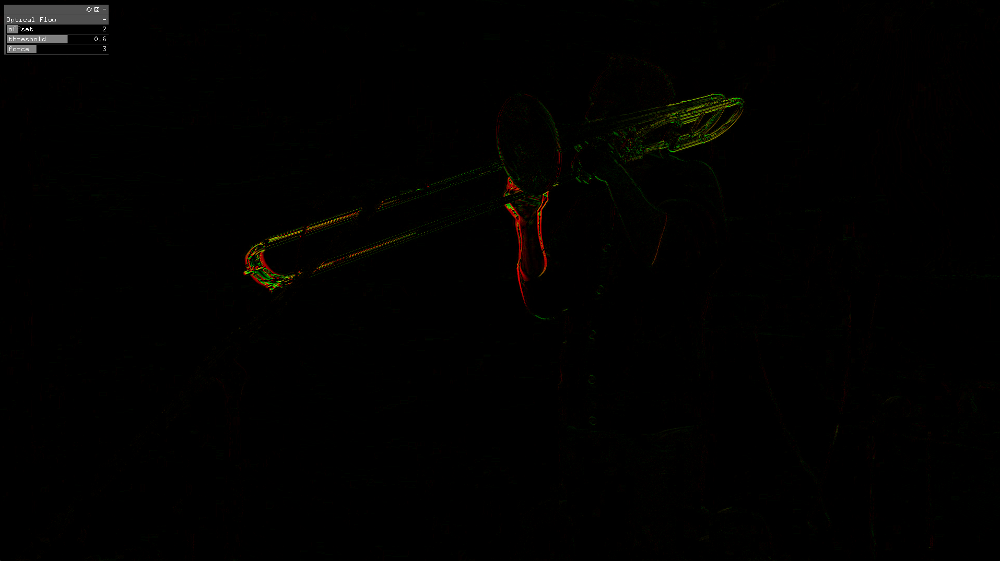

ofxMotionFromVideo
==================

GPU-based optical flow.

Introduction
------------
A GLSL-based optical flow processor that can consume pluggable frame sources.
`MotionFromVideo` is now a shell around source interfaces like `CameraFrameSource`,
`VideoFileFrameSource`, and `ExternalFrameSource`, so addons and apps can either
use the built-in camera/file wiring or feed externally owned FBOs.

License
-------
ofxMotionFromVideo is distributed under the [MIT License](https://en.wikipedia.org/wiki/MIT_License). See the [LICENSE](LICENSE.md) file for further details. Just add my name somewhere along your project [Steve Meyfroidt](https://meyfroidt.com) whenever possible.

Examples
--------
- `example_MotionFromVideo` shows direct camera-source wiring and optional dropped file input.
- `example_motionFileInput` starts idle and waits for an optional dropped video file.
- `example_VideoMotionIntoFluid` demonstrates external-frame wiring into the processor.

Dependencies
------------
- [ofxRenderer](https://github.com/smeyfroi/ofxRenderer) contains the GLSL code itself

Compatibility
------------
Developed against OpenFrameworks 0.12+.
